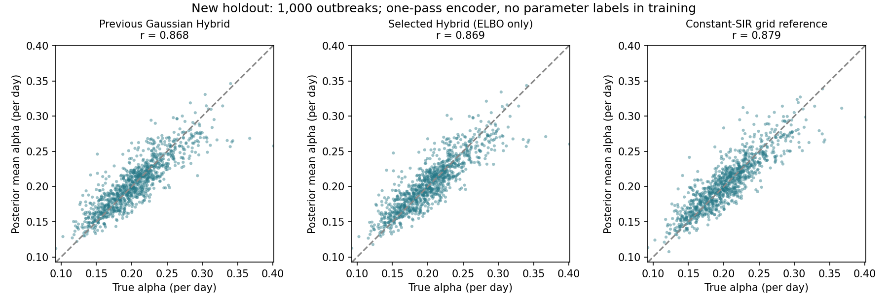

# 只用 ELBO 的最终确认实验

## 没有改动的训练原则

- 训练只用病例曲线、先验和 ELBO，不输入真实 β/α 或数值参考后验。
- 保留神经网络修正 β(t) 后进入 SIR 的 Hybrid decoder。
- 物理潜空间只包含 β、α；已知 ρ=0.10、k=10。4 维残差潜变量只用于神经修正。
- 测试时只调用一次编码器，不做逐曲线优化、不更新权重。必要的后验抽样只用于汇总分布。

## 排查得到的证据

首先检查了 SIR/负二项/KL 实现及导数，没有发现能解释旧结果的明显公式错误。
第一阶段用更充分的观测数据训练，参数点估计改善，但在种子 9103 的曲线上发现区间仍偏窄。
因此该批数据已转为开发记录，不能继续作为独立最终证据。

第二阶段保持 decoder 和 ELBO 不变，比较：

1. 在原二维高斯后验上增加可逆的弯曲变换，表示 β、α 之间非线性的依赖。
2. 相同继续训练预算，保持高斯后验。
3. 保持高斯，并添加由观测值计算的累计病例特征。

所有训练都不使用参数标签或后验教师。弯曲变换的 Jacobian 行列式为 1，KL 有解析表达式；
已通过逆变换、Jacobian、独立 Monte Carlo 密度计算以及梯度测试。

## 验证集选择

选择结果：`curved_hybrid`。只按验证 ELBO 选择，先保存选择记录，再生成最终测试曲线。

| 候选 | 验证负 ELBO（越小越好） | 继续训练轮次 |
|---|---:|---:|
| curved_hybrid | 349.47459 | 81 |
| continued_gaussian | 349.50817 | 100 |
| cumulative_gaussian | 349.50338 | 100 |

## 新保留数据上的 α 结果

训练 8,000 条（7101），验证 500 条（7102）；最终确认 1,000 条（10103），与第一阶段测试种子不同。
初始阶段 160 轮；第二阶段候选各继续 100 轮，按验证损失保留权重。第二阶段每条曲线用 8 个正负成对随机样本估计 ELBO，验证使用 32 样本。

| 方法 | 相关系数 | RMSE | 偏差 | 90% 区间覆盖率 |
|---|---:|---:|---:|---:|
| 第一阶段高斯 Hybrid | 0.868 | 0.0211 | +0.0006 | 84.4% |
| 验证集选定的 Hybrid | 0.869 | 0.0210 | +0.0008 | 86.3% |
| 可弯曲后验 + 纯 SIR | 0.869 | 0.0211 | +0.0008 | 87.4% |
| 纯 SIR 网格参考 | 0.879 | 0.0203 | +0.0010 | 88.8% |

## 选定 Hybrid 的全部指标

| 参数 | 相关系数 | RMSE | 偏差 | 90% 覆盖率 |
|---|---:|---:|---:|---:|
| beta | 0.979 | 0.0184 | +0.0011 | 86.3% |
| alpha | 0.869 | 0.0210 | +0.0008 | 86.3% |
| R0 | 0.973 | 0.1382 | -0.0053 | 85.9% |

β/α 联合 90% 区域覆盖率：85.7%。

## 不能过度解释的地方

- 近似后验不等于精确后验。相关性提高但覆盖率不足时，不能称为彻底解决。
- 本轮固定已知 ρ、k，不能直接推广到原三参数 Colab、未知报告倍数或真实疫情。
- 数值网格没有神经残差，只是纯 SIR 的参考，不是 Hybrid 的完整后验。
- 第一阶段比较同时涉及编码器结构、输入和初始化；不能把全部改善归因于其中一项。
- 第一阶段另一个随机初始化的 Hybrid 已记录在 `results_elbo/final/`；第二阶段最终候选尚未做多训练种子重复。
- 本轮没有干预/模型误设测试，不能宣称神经网络已经能稳健处理真实数据中的偏离。

## 数值参考稳定性

- 501×501、范围 ±5.0，最大边界质量 8.46e-05。
- 751×751、范围 ±6.0，最大边界质量 4.02e-08，相对前一网格最大均值变化 0.000337。

## 文件与复现

- `train_elbo_only.py`：第一阶段普通 ELBO 训练。
- `train_curved_elbo.py`：第二阶段后验形状/同预算训练对照。
- `infer_elbo_only.py`：统一的一次编码器推断入口。
- `evaluate_elbo_confirm.py`：仅按验证结果选择，再运行新保留集。
- `tests/check_elbo_only.py`、`tests/check_curved_elbo.py`：公式与推断行为测试。
- `results_elbo/confirmation/selection.json`：测试前的选择记录。
- `results_elbo/confirmation/evaluation.json`：完整指标。

```bash
/opt/anaconda3/envs/epidemic/bin/python train_curved_elbo.py
/opt/anaconda3/envs/epidemic/bin/python train_curved_elbo.py --checkpoint results_elbo/matched/model.pt --out results_elbo/curved_matched
/opt/anaconda3/envs/epidemic/bin/python train_curved_elbo.py --freeze_curve --out results_elbo/continued_gaussian
/opt/anaconda3/envs/epidemic/bin/python train_curved_elbo.py --cumulative --freeze_curve --out results_elbo/cumulative_gaussian
/opt/anaconda3/envs/epidemic/bin/python evaluate_elbo_confirm.py
/opt/anaconda3/envs/epidemic/bin/python summarize_elbo_confirm.py
```

先完成第一阶段训练，才能运行上述继续训练命令。修改后若再根据此最终保留集调整方法，需换新测试集。
原 Colab 基准保留；后验教师与逐曲线优化的探索不用于本轮成绩。本轮尚未推送 GitHub。


