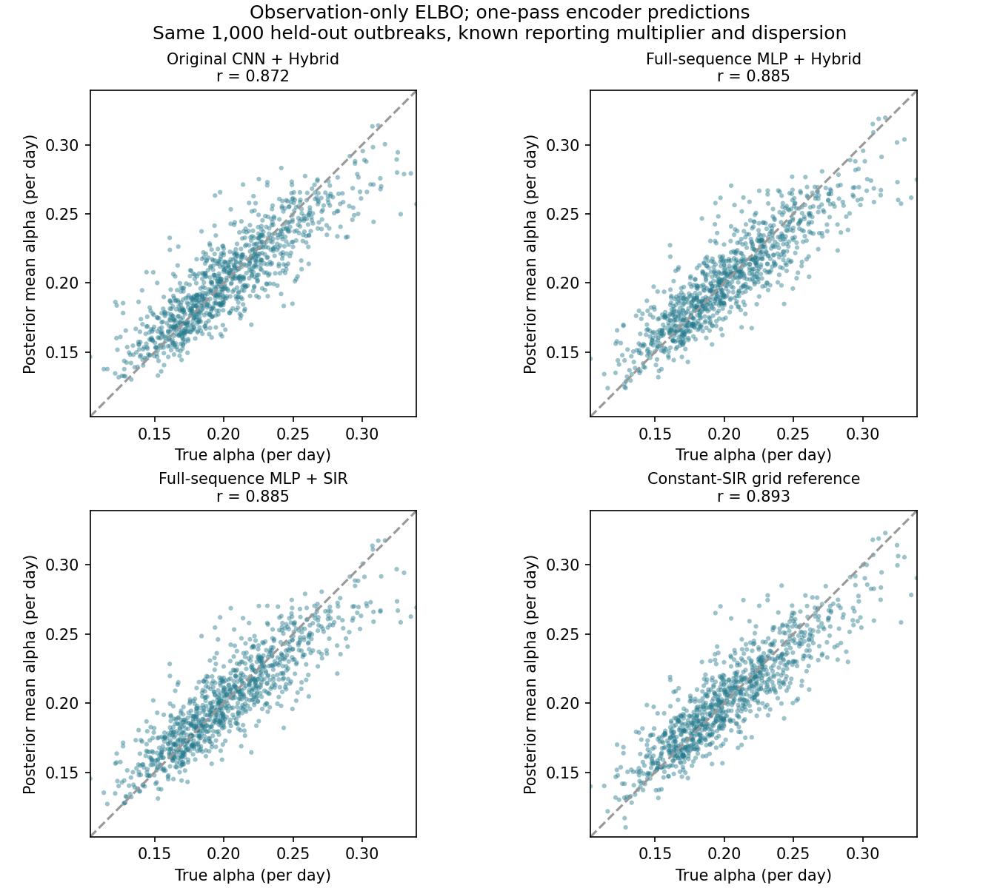

# 回到原训练原则：仅观测数据的 ELBO 实验

## 本轮保持的原则

训练只用病例曲线、SIR/神经 decoder 的似然和潜变量先验。没有真实参数监督、网格后验指导或训练后逐曲线优化。最终预测由一次编码器调用产生，再利用对数正态公式直接计算均值和区间，无需抽样。

只推断 β、α，已知 ρ=0.10、k=10。Hybrid 的神经网络先修正 β(t)，再进入 SIR；保留 4 维残差和 0.5 修正强度。纯 SIR 作为严格同模型对照。

## 修改及其意义

- 完整序列编码器保留全部 120 天的位置，输入包含 log1p(y) 和 sqrt(y)，用训练集统计量逐时间点标准化。
- 编码器输出满协方差高斯；物理后验初始标准差设为 exp(-1.5)，不从很宽、随机的预测分布开始。
- 普通 ELBO 使用 4 个正负成对的随机样本平均对数似然，降低梯度波动；KL 权重为 1，没有改成 IWAE。
- 学习率 0.001、余弦衰减、batch 128、160 轮。每 5 轮和最后一轮使用固定随机数的 16 样本验证 ELBO，按验证损失保存模型。
- 原卷积编码器作为同期对照，使用相同数据、训练轮数、优化器和 4 样本 ELBO。

编码器结构、输入处理和初始化作为一组修改比较。本实验不能单独证明某一个组件是唯一原因。

## 数据隔离

训练 8,000 条（种子 7101）；验证 500 条（种子 7102）；最终测试 1,000 条（种子 9103）。训练中丢弃生成参数标签。训练和权重选择完成后才评估测试集；后验网格是在编码器输出后才计算的评分参考。

## 最终 α 结果：同一批测试曲线

| 方法 | 相关系数 | RMSE | 偏差 | 90% 区间覆盖率 |
|---|---:|---:|---:|---:|
| 原卷积编码器 + Hybrid | 0.872 | 0.0200 | -0.0002 | 83.2% |
| 完整序列编码器 + Hybrid | 0.885 | 0.0191 | -0.0007 | 86.4% |
| 完整序列编码器 + 纯 SIR | 0.885 | 0.0191 | -0.0008 | 86.8% |
| 完整序列编码器 + Hybrid（训练种子17） | 0.884 | 0.0192 | -0.0009 | 87.1% |
| 纯 SIR 数值参考 | 0.893 | 0.0185 | -0.0005 | 90.0% |

数值参考没有神经残差，不能视为 Hybrid 的精确后验。这里只用它衡量纯 SIR 对照的推断误差，并展示已知 ρ、k 时数据允许的恢复水平。

## β 和 R₀ 的同步检查

| 方法 | 参数 | 相关系数 | RMSE | 偏差 | 90% 区间覆盖率 |
|---|---|---:|---:|---:|---:|
| 原卷积编码器 + Hybrid | beta | 0.981 | 0.0178 | -0.0003 | 84.1% |
| 原卷积编码器 + Hybrid | R0 | 0.976 | 0.1337 | -0.0047 | 83.8% |
| 完整序列编码器 + Hybrid | beta | 0.983 | 0.0168 | -0.0006 | 87.1% |
| 完整序列编码器 + Hybrid | R0 | 0.981 | 0.1200 | -0.0016 | 86.8% |
| 完整序列编码器 + 纯 SIR | beta | 0.983 | 0.0169 | -0.0008 | 86.9% |
| 完整序列编码器 + 纯 SIR | R0 | 0.981 | 0.1195 | +0.0002 | 87.3% |
| 完整序列编码器 + Hybrid（训练种子17） | beta | 0.983 | 0.0169 | -0.0008 | 86.8% |
| 完整序列编码器 + Hybrid（训练种子17） | R0 | 0.981 | 0.1208 | -0.0014 | 86.9% |

## 联合后验及 α 区间校准

- 原卷积编码器 + Hybrid：β/α 联合 90% 区域覆盖率 85.6%；α 各名义水平实际覆盖率 {'0.5': 0.43799999356269836, '0.8': 0.7379999756813049, '0.9': 0.8320000171661377, '0.95': 0.9089999794960022}。
- 完整序列编码器 + Hybrid：β/α 联合 90% 区域覆盖率 85.9%；α 各名义水平实际覆盖率 {'0.5': 0.4480000138282776, '0.8': 0.7649999856948853, '0.9': 0.8640000224113464, '0.95': 0.9269999861717224}。
- 完整序列编码器 + 纯 SIR：β/α 联合 90% 区域覆盖率 85.9%；α 各名义水平实际覆盖率 {'0.5': 0.4560000002384186, '0.8': 0.7739999890327454, '0.9': 0.8679999709129333, '0.95': 0.9240000247955322}。
- 完整序列编码器 + Hybrid（训练种子17）：β/α 联合 90% 区域覆盖率 86.0%；α 各名义水平实际覆盖率 {'0.5': 0.44699999690055847, '0.8': 0.7559999823570251, '0.9': 0.8709999918937683, '0.95': 0.9190000295639038}。

## 验证选择与神经修正

- 原卷积编码器 + Hybrid：选择第 160 轮，验证负 ELBO=349.5115；测试曲线平均绝对 log β 修正=0.00053。
- 完整序列编码器 + Hybrid：选择第 160 轮，验证负 ELBO=349.5010；测试曲线平均绝对 log β 修正=0.00086。
- 完整序列编码器 + 纯 SIR：选择第 156 轮，验证负 ELBO=349.4972；测试曲线平均绝对 log β 修正=0.00000。
- 完整序列编码器 + Hybrid（训练种子17）：选择第 156 轮，验证负 ELBO=349.4977；测试曲线平均绝对 log β 修正=0.00073。

## 如何理解证据

这次不靠参考答案训练，也不在测试时优化。结果应根据均值误差和覆盖率共同判断，不能只看相关性。
固定已知 ρ、k 与原三参数 Colab 的任务不同，不能宣称本轮已解释原实验的全部误差。
Hybrid 另用训练种子 17 重复，两个结果均报告；对模型误设、未知报告倍数或真实疫情的效果仍需另做实验。
如果覆盖率明显偏离 90%，即使相关性提高，也应继续标记为未解决。

检查通过：生成器/纯 SIR decoder 均值一致，KL 与 PyTorch 分布公式一致，多样本目标确为普通 ELBO，SIR 导数通过有限差分核对，推断只调用一次编码器且不改变权重。

## 数值参考稳定性

- 501×501、范围 ±5.0：最大边界后验质量 7.43e-05。
- 751×751、范围 ±6.0：最大边界后验质量 4.49e-08；相对上一网格最大均值变化 0.000335。

## 复现

```bash
/opt/anaconda3/envs/epidemic/bin/python train_elbo_only.py --scale 0 --out results_elbo/matched
/opt/anaconda3/envs/epidemic/bin/python train_elbo_only.py --scale 0.5 --out results_elbo/hybrid
/opt/anaconda3/envs/epidemic/bin/python train_elbo_only.py --encoder cnn --scale 0.5 --out results_elbo/cnn_control
/opt/anaconda3/envs/epidemic/bin/python evaluate_elbo_only.py
/opt/anaconda3/envs/epidemic/bin/python summarize_elbo_only.py
```

完整指标含每个模型配置和权重哈希，保存在 evaluation.json。模型、训练日志和绘图数据也保留。
此后若根据这批测试数据修改方法，需使用新的保留数据评估。旧 Colab 和已上传基准保留，本轮尚未推送 GitHub。


