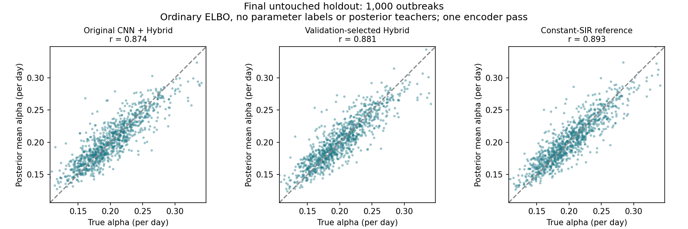

# α 恢复排查：仅观测数据、普通 ELBO、一次编码器推断

## 结论

尚未彻底解决。验证选定的 Hybrid 在全新 1,000 条曲线上的 α 相关性为 0.881、RMSE 为 0.0192，接近纯 SIR 数值参考的 0.893 和 0.0183；但名义 90% 区间实际覆盖率为 86.9%，仍有欠覆盖。
同一批数据上数值参考的覆盖率为 88.5%，也有有限样本波动。不能把“接近参考”说成完整后验已经准确或原三参数问题已经解决。

## 本轮遵守的约束

所有新训练只用病例曲线、SIR/神经 decoder 的似然和潜变量先验。没有真实参数监督、数值后验教师或测试时优化。只推断 β、α，ρ=0.10 和 k=10 作为已知常数。

Hybrid decoder 保留两个模型：神经网络产生 β(t) 的修正（强度 0.5，4 维残差），再由 SIR 生成病例均值。测试输入病例曲线后，编码器一次输出整个近似后验；分布汇总不改变网络权重。

## 已做的排查

1. 核对生成器与纯 SIR decoder 均值、负二项似然、解析 KL 和 SIR 梯度，没有发现明显公式错误。
2. 原卷积编码器与完整时间序列编码器使用相同 8,000 条训练、500 条验证曲线、160 轮普通 ELBO。采用多样本平均对数似然降低梯度波动；不是 IWAE。
3. 第一轮测试发现参数点估计改善，但区间偏窄。该测试集随后转为开发数据。
4. 在相同训练/验证集上，对照继续训练的高斯、可弯曲后验和累计病例特征。第二批新测试仍显示欠覆盖，也转为开发数据。
5. 最后尝试两分量混合后验。所有候选仍用原 ELBO，没有后验教师。混合后验采用分层重参数采样，按混合权重求期望。
6. 最终在未使用过的保留数据上确认，下面只引用这一批结果。

## 最终选择与隔离

训练种子 7101，验证种子 7102。最终保留集种子 11103，共 1,000 条曲线。
先比较验证 ELBO（五组固定随机流、每条曲线总计 32 次似然计算），保存选择记录，之后才生成最终测试数据。
数值网格在编码器预测完成后才计算，只用于评分参考。

验证集选定版本：**完整序列编码器 + 可弯曲后验**，权重文件 `results_elbo/curved_hybrid/model.pt`。

| 候选 | 平均验证负 ELBO（越小越好） |
|---|---:|
| 完整序列编码器 + 可弯曲后验 | 349.46507 |
| 完整序列编码器 + 两分量后验 | 349.46761 |

## α：同一批最终保留曲线

| 方法 | 相关系数 | RMSE | 偏差 | 90% 覆盖率 |
|---|---:|---:|---:|---:|
| 原卷积编码器 + Hybrid | 0.874 | 0.0197 | +0.0011 | 83.5% |
| 完整序列编码器 + 高斯后验 | 0.879 | 0.0193 | +0.0006 | 85.4% |
| 完整序列编码器 + 可弯曲后验（验证选定） | 0.881 | 0.0192 | +0.0007 | 86.9% |
| 完整序列编码器 + 两分量后验 | 0.881 | 0.0192 | +0.0006 | 87.4% |
| 纯 SIR 数值参考 | 0.893 | 0.0183 | +0.0010 | 88.5% |

## 验证选定 Hybrid 的全部指标

| 参数 | 相关系数 | RMSE | 偏差 | 90% 覆盖率 |
|---|---:|---:|---:|---:|
| beta | 0.981 | 0.0167 | +0.0010 | 87.0% |
| alpha | 0.881 | 0.0192 | +0.0007 | 86.9% |
| R0 | 0.977 | 0.1239 | -0.0022 | 85.7% |

## 怎么理解“有没有彻底弄好”

点估计和不确定性是两个问题。能提高相关性，不等于后验已经准确。应同时查看 RMSE、偏差和区间覆盖率；若名义 90% 的覆盖率仍不足，必须保留这一未解决项。

本轮没有用参考答案或逐曲线优化来换取成绩，也没有按测试结果挑选较好的候选。数值参考本身仍有误差，参数估计不可能要求每条有噪声曲线都等于真值。

以下结论不能由本轮实验推出：

- 原三参数 Colab 的全部误差都来自某一个代码 bug；本轮没有发现这种单一错误。
- 只改网络结构就能解释全部改善；输入、初始化、样本数和训练预算也有变化。
- 固定已知 ρ、k 的结果能直接推广到未知报告倍数或真实疫情。
- 纯 SIR 网格是完整 Hybrid 的精确后验；它没有神经残差。
- 本轮已证明对干预/模型误设稳健；这些场景尚未在最终版本上验证。

本轮是在已有失败现象基础上开展的多阶段开发。前两批测试已转为开发记录；只有第三批保留集作为这里的最终确认。以后若再据它调整方法，需要另外的保留数据。

## 入口和文件

- `infer_elbo_only.py`：统一一次编码器推断入口；支持高斯、可弯曲和混合后验。
- `train_elbo_only.py`：第一阶段观测数据 ELBO。
- `train_curved_elbo.py`：后验形状与同预算对照。
- `train_mixture_elbo.py`：两分量后验的普通 ELBO。
- `evaluate_mixture_confirm.py`：验证选择和最终保留集评分。
- `tests/check_elbo_only.py`、`tests/check_curved_elbo.py`、`tests/check_mixture_elbo.py`：公式、梯度、分布和一次推断测试。
- `results_elbo/final_holdout/selection.json`：测试前的选择。
- `results_elbo/final_holdout/evaluation.json`：最终完整指标。

推断示例（输入为包含 120 天非负病例数的 .npy 数组）：

```bash
/opt/anaconda3/envs/epidemic/bin/python infer_elbo_only.py cases.npy --checkpoint results_elbo/curved_hybrid/model.pt
```

完整训练流程和阶段选择见 `results_elbo/PROTOCOL.md`。模型权重、日志及最终预测均已保留。
原 Colab 基准未覆盖；后验教师、逐曲线优化两条探索路线不属于当前方案。本轮尚未推送 GitHub。


